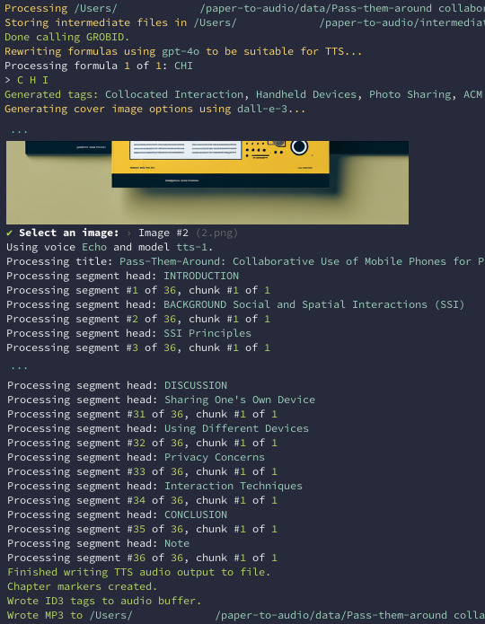

# 🎙️ `paper-to-audio`

Convert academic papers and PDFs to audio using [GROBID](https://github.com/kermitt2/grobid) and [OpenAI](https://openai.com)'s TTS API.

Features:

-   Encodes chapter marks into MP3.
-   Adapts formulas to be more suitable for TTS using OpenAI's GPT-4 LLM.
-   Generates cover image using OpenAI's Dall-E.

> [!IMPORTANT]
> Requires an OpenAI API key. A 10 page research paper will be ~30-60 minutes in length and cost $0.50 to $1 to generate.

## Preview

The following is a 30 second snippet generated from a PDF:


Example of generated cover images:


Screenshot of CLI:



## Setup

Requirements:

1. NodeJS (tested with v21) and Yarn v1 installed
2. OpenAI API key

Create a `.env` with your OpenAI key:

```sh
OPENAI_API_KEY=...
```

Install dependencies:

```
yarn install
```

Run with the path to your PDF file:

```
yarn start ./data/Example/Example.pdf
```

The MP3 file will be saved in the same directory as the PDF, e.g. `./data/Example/Example.mp3`.

Data used for generating the file are stored in `./intermediate`, and will be re-used in successive runs.

## Optional configuration

Currently, parameters are configured using environment variables instead of CLI options. In addition to the OpenAI API key, the following environment variables can be set:

```sh
GROBID_URL=http://localhost:8070 # defaults to https://kermitt2-grobid.hf.space
TTS_VOICE=echo # Defaults to random voice, see options at https://platform.openai.com/docs/guides/text-to-speech/voice-options
TTS_MODEL=tts-1
IMAGE_MODEL=dall-e-3
LLM_MODEL=gpt-4o # Used for adapting formulas
INCLUDE_FIGURES=true # Include figure texts in audio. Defaults to false.
SKIP_CITATIONS=true # Skip in-text citations. Defaults to false.
```
